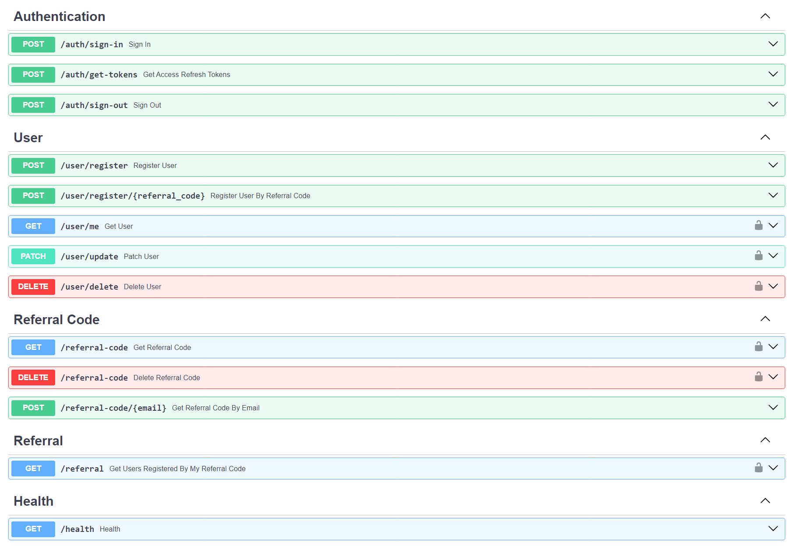

# Project for referrals registration

This REST API is made for [test](https://docs.google.com/document/d/1YaiDiza5U3i0ZxmYuZt7ZCRgGycLgDnq/edit) project
<br/>

## Running on:

* Windows 11

* Python 3.11.4 or higher

* PostgreSQL
* Redis

## How to run

### Install from git:

#### Using GitHub:

```shell
$ git clone https://github.com/abstract-333/referral-api.git

$ cd referral-api
```

or

#### Using GitFlic:

```shell
$ git clone https://gitflic.ru/project/abstract-333/referral-api.git

$ cd referral-api
```

### Create and activate virutal environment:

```shell
$ python -m venv env

$ .\env\Scripts\activate
```

### Install dependencies:

```shell
$ pip install -r requirements.txt
```

### Make migration for database:

_<strong>
First Create database under "name".
<br>
Add this name and other properties to .env.prod file.
</strong>_
<br>
<br>

```shell
$ alembic upgrade heads
```

### Run App:

```shell
$ cd src
$ uvicorn app:app --reload
```

## Main Concepts:

* Using [Refresh and Access Tokens](https://stateful.com/blog/oauth-refresh-token-best-practices), so we don't have to
  ask
  user every time for credentials in order to make authorization complete, also it makes our app safer even if someone
  else stole user's access token it will be valid for short period. When user needs new access token he can use his
  refresh
  token in order to get new access and refresh tokens, and old refresh token will be sent to blacklist. Sign-out do the
  same almost but here we don't return any tokens to user obviously :)
* [Dynamic Salt](https://auth0.com/blog/adding-salt-to-hashing-a-better-way-to-store-passwords/) is a great choice when
  you need to secure your password hash from rainbow table.
* Implementing UoW and repository patterns.
* [UUID v7](https://www.ietf.org/archive/id/draft-peabody-dispatch-new-uuid-format-04.html#name-uuid-version-7) is must
  have.
* The
  system treats
  these emails similarly (_user@example.com_, _u.s.e.r@example.com_), see why
  it's [important](https://support.google.com/mail/answer/7436150?hl=en#:~:text=Adding%20dots%20doesn't%20change,or%20forgot%20the%20correct%20address.).
* Adding Docs for all routers.
* Using pydantic in order to make validation simple and safe,
  also [Pydantic Settings](https://docs.pydantic.dev/latest/concepts/pydantic_settings/) sounds good to manage
  environment
  variables from one place.
* For referral code I use [Nano ID](https://zelark.github.io/nano-id-cc/).
* Using [Brotli Compression](https://www.coralnodes.com/gzip-vs-brotli/)
  and [ORJSON](https://github.com/ijl/orjson), which increase the
  performance of API.
  
* [Health Check pattern](https://microservices.io/patterns/observability/health-check-api.html). The API endpoint
  handler performs various checks, such as
  the status of the connections to the infrastructure services used by the service instance,
  the status of the host and application specific logic.

## ERD:


## Routers:


